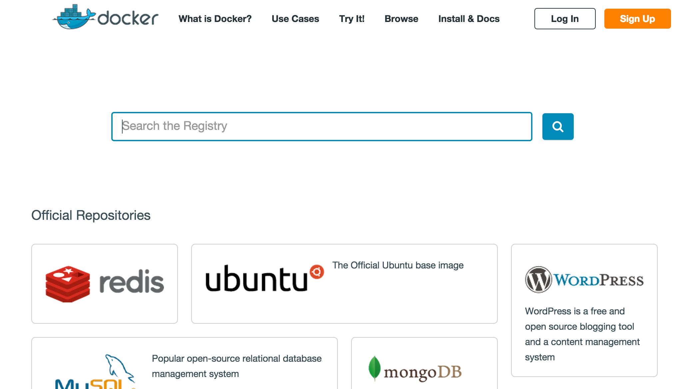

### [Back: Introduction](../introduction.md)

1. First step
=============

## Installing Tow

To install Tow simply run:

```console
$ pip install tow
```

Confirm Tow has successfully installed.

```console
$ tow
tow is configuration management tool for docker containers
...
DOCKER-OPTIONS - options for docker build or run command
```

## Create Tow project

To get Nginx up and running we need:

- Install Nginx
- Generate site config
- Generate example webpage

Let's create Tow project and start implementing.

```console
$ tow create tow-nginx-example
```

If we look inside the Tow project directory we can see the following:

```console
$ cd tow-nginx-example
$ ls
Dockerfile  attributes/ files/  mapping.py  templates/

```

So now we need to write our Dockerfile to install and configure Nginx server. How do we do that? First of all we should peek a base Docker image. Thanks to [Docker Hub](https://registry.hub.docker.com) it's really easy.



Here is a lot of prebuild, tested Docker images you. Let's use [debian](https://registry.hub.docker.com/_/debian/), it's a stable lightweight image (only ~90 mb) which is definitely recommended for using like a base image for your Dockerfiles. Open `Dockerfile` in your favorite text editor and make it looks like this:

```Dockerfile
FROM debian:jessie

RUN apt-get update && \
    apt-get install -y nginx

RUN rm -rf /var/lib/apt/lists/* && \
    chown -R www-data:www-data /var/lib/nginx

VOLUME /var/www/html
WORKDIR /etc/nginx
EXPOSE 80

CMD ["nginx", "-g", "daemon off;"]
```

## First run

Now we have a Dockerfile which just installs and starts Nginx server.
Okay. Let's see what we've got so far works!

```console
$ tow build -t tow-nginx-example
...
Successfully built 7dcf627e2037
$ tow run -d -p 8080:80 tow-nginx-example
$ curl localhost:8080
curl: (7) Failed to connect to localhost port 8080: Connection refused
```

See, it still doesn't work, because we still have to add site configuration and web page into our tow-nginx-example image. Commit you file into git and move to the next step.

```console
$ git add -A
$ git commit -m 'Initial commit'
```

### [Next: 2. Deal with dynamic configuration](step-2-deal-with-dynamic-configuration.md)